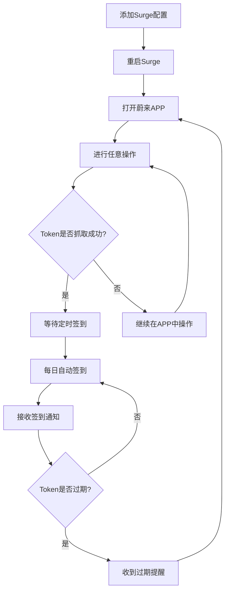

# 🚗 蔚来APP全自动签到脚本 (融合版)

<div align="center">


**一个基于Surge的蔚来APP全自动签到脚本，自动抓取token，无需手动配置！**

[功能特性](#-功能特性) • [快速开始](#-快速开始) • [配置说明](#-配置说明) • [常见问题](#-常见问题) • [更新日志](#-更新日志)

</div>

---

## 🌟 新版本亮点

### 🔥 全自动Token管理
- ✅ **自动抓取Token** - 无需手动抓包，脚本自动拦截并保存token
- ✅ **智能Token管理** - 自动检测token过期，提醒用户更新
- ✅ **零配置使用** - 首次使用只需在蔚来APP中进行任意操作
- ✅ **持久化存储** - Token安全保存在本地，重启不丢失

### 🚀 一键部署
- ✅ **单脚本解决方案** - 一个脚本包含所有功能
- ✅ **智能模式切换** - 自动识别拦截模式和签到模式
- ✅ **完整配置模板** - 提供完整的Surge配置，复制即用

## 📱 功能特性

- 🔑 **自动Token管理** - 自动抓取、保存、验证Authorization token
- ✅ **自动签到** - 每日定时自动签到蔚来APP
- 📊 **详细统计** - 显示连续签到天数和累计签到天数
- 🔔 **智能通知** - 签到成功/失败/Token状态实时通知
- 🔄 **重试机制** - 网络异常自动重试，提高成功率
- ⏰ **定时任务** - 支持Surge定时任务，完全自动化
- 🛡️ **错误处理** - 完善的错误处理和日志记录
- 🎯 **轻量级** - 单文件脚本，简单易用
- ⚡ **零配置** - 无需手动配置token，完全自动化

## 🚀 快速开始

### 第一步：添加Surge配置

将以下配置添加到你的Surge配置文件中：

```ini
[Script]
# Token自动抓取
蔚来Token抓取 = type=http-request,pattern=^https://(gateway-front-external\.nio\.com|app\.nio\.com|api\.nio\.com)/.*,script-path=weilai-auto-checkin.js,timeout=10

# 定时签到任务
蔚来自动签到 = type=cron,cronexp=0 9 * * *,script-path=weilai-auto-checkin.js,timeout=30,wake-system=1

[MITM]
hostname = gateway-front-external.nio.com, app.nio.com, api.nio.com
```

### 第二步：下载脚本

1. 下载 `weilai-auto-checkin.js` 文件
2. 将文件放到Surge的脚本目录

### 第三步：激活Token抓取

1. 重启Surge或重新加载配置
2. 打开蔚来APP
3. 进行任意操作（浏览、签到、查看个人信息等）
4. 脚本会自动抓取并保存token

### 第四步：享受自动签到

- 第二天早上9点会自动签到
- 无需任何手动操作
- 签到结果会通过通知告知

## ⚙️ 配置说明

### 🔧 基础配置

| 配置项 | 说明 | 默认值 | 是否必须 |
|--------|------|--------|----------|
| `tokenValidDays` | Token有效期(天) | `30` | ❌ 可选 |
| `maxRetries` | 最大重试次数 | `3` | ❌ 可选 |
| `retryDelay` | 重试间隔(毫秒) | `2000` | ❌ 可选 |

### ⏰ 定时任务配置

| 时间表达式 | 说明 | 推荐指数 |
|------------|------|----------|
| `0 9 * * *` | 每天9点 | ⭐⭐⭐⭐⭐ |
| `0 8 * * *` | 每天8点 | ⭐⭐⭐⭐ |
| `0 22 * * *` | 每天22点 | ⭐⭐⭐ |

### 🎯 手动操作

```ini
# 添加到Surge配置文件中
[Script]
蔚来手动签到 = type=http-request,pattern=^https://manual-checkin\.test$,script-path=weilai-auto-checkin.js,timeout=30

[URL Rewrite]
^https://weilai\.checkin$ https://manual-checkin.test 302
```

然后在Safari中访问 `https://weilai.checkin` 即可手动签到。

## 📊 使用流程图



## 📋 签到结果示例

### 🎉 成功签到
```
✅ 蔚来签到 - 签到成功 🎉
已连续签到 249 天
📊 累计签到: 255 天
```

### ℹ️ 今日已签到
```
ℹ️ 蔚来签到 - 今日已签到 ✅
已连续签到 249 天
```

### 🔑 Token状态
```
✅ 蔚来Token - Token已自动获取 🔑
签到脚本将自动使用新token
```

### ⚠️ Token过期
```
⚠️ 蔚来签到 - Token已过期 ⏰
请在蔚来APP中进行操作以更新token
```

## 🔧 故障排除

### 常见问题

<details>
<summary><strong>Q: Token没有自动抓取到？</strong></summary>

**A:** 检查以下几点：
1. 确认Surge的MITM功能已开启
2. 确认已添加蔚来域名到MITM列表
3. 确认已安装并信任Surge的CA证书
4. 在蔚来APP中多进行几次操作
5. 查看Surge日志是否有拦截记录

</details>

<details>
<summary><strong>Q: 签到失败，提示Token过期？</strong></summary>

**A:** Token过期处理：
1. 打开蔚来APP
2. 进行任意操作（浏览、签到、查看信息等）
3. 脚本会自动抓取新token
4. 等待下次定时签到或手动触发签到

</details>

<details>
<summary><strong>Q: 如何检查Token状态？</strong></summary>

**A:** 有两种方法：
1. **手动执行脚本**：在Surge中手动运行脚本
2. **访问状态页面**：添加URL重写规则后访问 `https://weilai.token`

</details>

<details>
<summary><strong>Q: 脚本执行没有反应？</strong></summary>

**A:** 检查以下几点：
1. 确认Surge配置正确
2. 检查脚本路径是否正确
3. 查看Surge日志是否有错误信息
4. 确认网络连接正常
5. 尝试手动执行脚本测试

</details>

### 🔍 调试模式

添加调试配置：
```ini
[Script]
蔚来调试模式 = type=http-request,pattern=^https://debug-weilai\.test$,script-path=weilai-auto-checkin.js,timeout=30,debug=1

[URL Rewrite]
^https://weilai\.debug$ https://debug-weilai.test 302
```

访问 `https://weilai.debug` 查看详细调试信息。

## 📝 更新日志

### v2.0.0 (2024-12-26) - 融合版
- 🎉 **重大更新**：融合Token抓取和签到功能
- ✨ 新增自动Token抓取功能
- ✨ 新增智能Token管理
- ✨ 新增零配置使用体验
- 🔧 优化脚本架构，单文件解决方案
- 📱 改进用户体验，完全自动化
- 🛡️ 增强错误处理和日志记录

### v1.2.0 (2024-12-26)
- ✨ 新增重试机制，提高签到成功率
- 🎨 优化日志输出，增加emoji图标
- 🔧 改进错误处理逻辑
- 📊 增加详细的签到统计信息
- 🛡️ 添加配置检查功能

### v1.1.0 (2024-12-25)
- ✨ 添加详细的签到信息显示
- 🔔 优化通知内容
- 🐛 修复响应解析问题

### v1.0.0 (2024-12-24)
- 🎉 首次发布
- ✅ 基础签到功能
- ⏰ 定时任务支持

## 🤝 贡献指南

欢迎提交Issue和Pull Request！

1. Fork本仓库
2. 创建特性分支 (`git checkout -b feature/AmazingFeature`)
3. 提交更改 (`git commit -m 'Add some AmazingFeature'`)
4. 推送到分支 (`git push origin feature/AmazingFeature`)
5. 开启Pull Request

## ⚠️ 免责声明

- 本脚本仅供学习和个人使用
- 请遵守蔚来APP的使用条款
- 使用本脚本产生的任何问题，作者不承担责任
- 建议合理使用，避免频繁请求
- Token信息仅保存在本地，不会上传到任何服务器

## 📄 许可证

本项目基于 [MIT License](LICENSE) 开源协议。

## 🌟 Star History

如果这个项目对你有帮助，请给个Star支持一下！

---

<div align="center">

**Made with ❤️ by GitHub Community**

[⬆ 回到顶部](#-蔚来app全自动签到脚本-融合版)

</div>